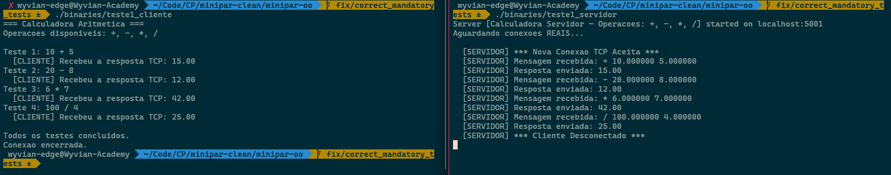

# Testes Obrigatorios

Lista de testes criados pelo professor para validacao do compilador minipar

# ✅ 1. Calculadora Simples via Servidor
- PC1 (cliente) solicita ao PC2 (servidor) a execucao de uma operacao aritmetica e recebe o resultado via SOCKET. 
- Codigo interativo com o usuario (PC1 pede ao usuario qual operacao ele deseja realizar)
- Executar em computadores diferentes tambem

## Codigo Minipar
[Codigo Minipar para Teste 1 - Cliente](test1_calc_client.minipar)
[Codigo Minipar para Teste 1 - Servidor](test1_calc_server.minipar)

## TODO
- [x] comunicacao via SOCKET

## Teste

# ⚠️ 2. Execucao paralela via threads
- Calcular fatorial e fibonacci de forma paralela

## Codigo Minipar
[Codigo Minipar para Teste 2](test2_par_fat_fib.minipar)

## TODO
- [ ] Implementar blocos paralelos

# ⚠️ 3. Rede Neural com OOP
- Definicao da classe Neuronio com atributos e metodos
- Instanciacao de objeto com Construtor recebendo parametros
- Chamada de metodo de classe

## Codigo Minipar
[Codigo Minipar para Teste 3](test3_neuronio.minipar)

## TODO
- [ ] Corrigir implementacao de Classe com funcoes e metodos
- [ ] Adicionar suporte ao Construtor com passagem de parametro
- [ ] Corrigir codigo C para chamada de funcao

# ⚠️ 4. Rede Neural com OOP para Funcao XOR
- Rede Neural com camada oculta
- Definicao da classe Neuronio com atributos e metodos
- Definicao da classe Rede Neural
- Instanciacao de objeto
- Chamada de metodo de classe
- Funcoes builtin: exp(), random(), len()
- Estruturas de dados: array de duas dimensoes ([[0, 0], [0, 1], ...])

## Codigo Minipar

## TODO
- [ ] Escrever codigo em Minipar
- [ ] Corrigir implementacao de Classe com funcoes e metodos
- [ ] Adicionar suporte ao Construtor com passagem de parametro
- [ ] Corrigir codigo C para chamada de funcao
- [ ] Implementar builtin exp() no codigo C
- [ ] Implementar builtin random() no codigo C
- [ ] Implementar builtin len() no codigo C

# ⚠️ 5. Rede Neural para recomendacao de produtos
- Rede Neural com camada oculta
- Definicao da classe Neuronio com atributos e metodos
- Definicao da classe Rede Neural
- Instanciacao de objeto
- Chamada de metodo de classe
- Funcoes builtin: max(), exp(), print()

## Codigo Minipar

## TODO
- [ ] Escrever codigo em Minipar
- [ ] Corrigir implementacao de Classe com funcoes e metodos
- [ ] Adicionar suporte ao Construtor com passagem de parametro
- [ ] Corrigir codigo C para chamada de funcao
- [ ] Implementar builtin exp() no codigo C
- [ ] Implementar builtin max() no codigo C

# ⚠️ 6. Quicksort com OOP
- Definicao da classe Quicksort com atributos e metodos
- Definicao da classe InterfaceOrdenacao com metodo
- Try/Catch para leitura de caracteres no lugar de digitos
- Funcoes builtin: input() para numeros, print(), strip() para separar numeros (?)

## Codigo Minipar
[Codigo Minipar para Teste 6](test6_quicksort_classe.minipar)

## TODO
- [ ] Atualizar codigo para receber numeros via INPUT
- [ ] Atualizar codigo para ter seguranca (caso o resultado de INPUT nao sejam numeros)
- [ ] Atualizar codigo para nao usar strip(), mas sim pedir total de numeros e os numeros via INPUT
- [ ] Corrigir implementacao de Classe com funcoes e metodos
- [ ] Adicionar suporte ao Construtor com passagem de parametro
- [ ] Corrigir codigo C para chamada de funcao

# ⚠️ 7. Quicksort iterativo
- Sem recursao
- Uso de pilha de tuplas para simular recursao
- Funcoes builtin: append(), pop() -> exigem array dinamico, vamos precisar adaptar (usar indice)

## Codigo Minipar

## TODO
- [ ] Escrever codigo em Minipar sem append e pop

# ⚠️ 8. Adicional 1: Real Paralelismo
- **Quicksort** no PC1, **Multiplicacao de Matrizes** no PC2 e **Fatorial** no PC3
- Incluir menu para a selecao do calculo a ser executado
- Resultado deve ser recebido de um dos servidores via canal de comunicacao (SOCKET)
- Identificar servidores via IP e Porta

## Codigo Minipar
[Codigo Minipar para Adicional 1 - PC1, Quicksort e Menu](add1_comp1_menu.minipar)
[Codigo Minipar para Adicional 1 - PC2, Multiplicacao de Matriz](add1_comp2_matmul.minipar)
[Codigo Minipar para Adicional 1 - PC3, Fatorial](add1_comp3_fatorial.minipar)

## TODO
- [ ] Alterar codigo do PC1 para pegar opcao do usuario via INPUT
- [ ] Alterar codigo do PC1 para executar opcao conforme INPUT

# ⚠️ 9. Adicional 2: Fractal
- tapete de Sierpinski recursivo
- Simular a tela com uma matriz e simular desenho ao inserir caracter (ponto ou asteristo)

## Codigo Minipar

## TODO
- [ ] Escrever codigo em Minipar
- [ ] Suporte a matriz (array de duas dimensoes)
