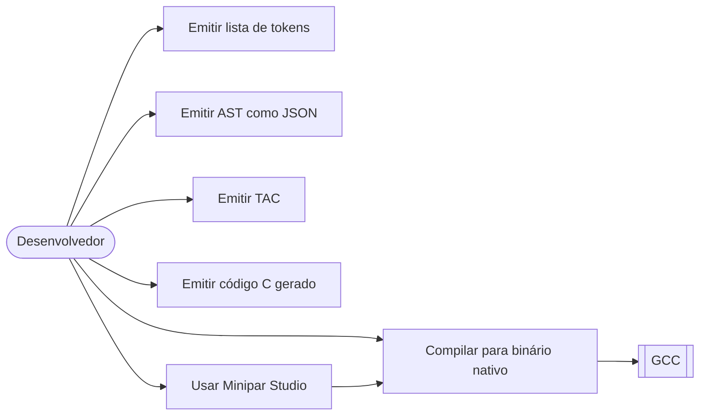
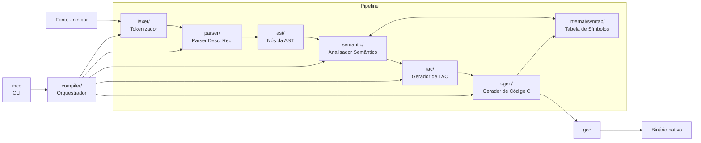
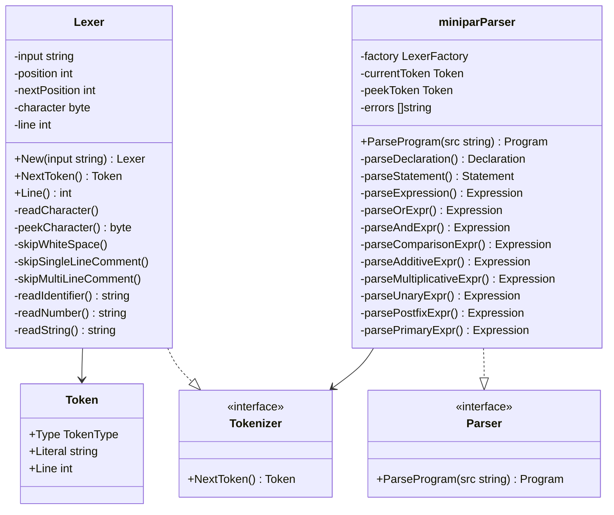
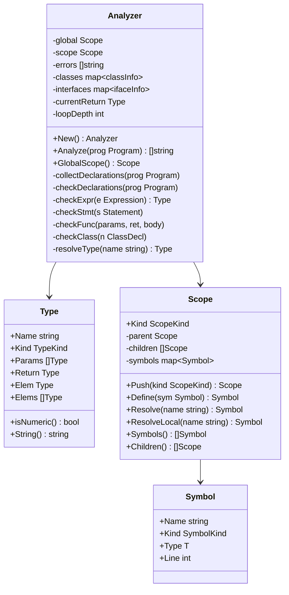
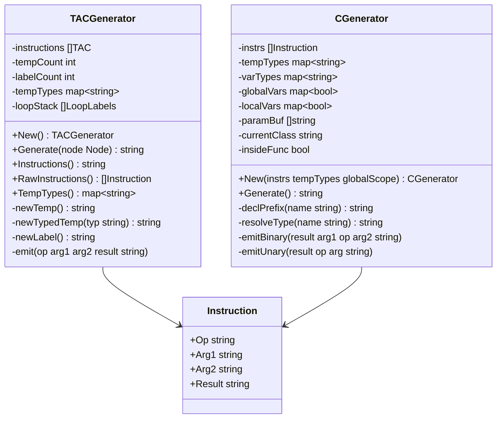

<!--
Build:  pandoc RELATORIO.md -o RELATORIO.pdf \
          --pdf-engine=xelatex \
          -V geometry:margin=2.5cm \
          -V lang=pt-BR

Deps:   sudo apt install pandoc texlive-xetex texlive-lang-portuguese \
                         texlive-latex-recommended texlive-fonts-recommended
-->

---
title: "Relatório Técnico: Desenvolvimento do Compilador para a Linguagem MiniPar v2025.1"
author:
  - Wyvian Gabrielly Cavalcante Valença
  - Ycaro Bruno Souza Sales
  - Felipe Lira da Silva
  - Marcos Mendonça
  - João Gabriel Seixas
date: "2025"
lang: pt-BR
toc: true
toc-depth: 3
numbersections: true
geometry: margin=2.5cm
mainfont: "DejaVu Serif"
monofont: "DejaVu Sans Mono"
---

\begin{center}

\vspace*{2cm}

\textbf{UNIVERSIDADE FEDERAL DE ALAGOAS}

Instituto de Computação

\textbf{CIÊNCIA DA COMPUTAÇÃO}

\vspace{4cm}

Wyvian Gabrielly Cavalcante Valença\\
Ycaro Bruno Souza Sales\\
Felipe Lira da Silva\\
Marcos Mendonça\\
João Gabriel Seixas

\vspace{3cm}

\textbf{Relatório Técnico: Desenvolvimento do Compilador para a Linguagem MiniPar v2025.1}

\vspace{1cm}

GitHub: \texttt{https://github.com/Ycaro-sales/minipar-oo}

Vídeo de demonstração: Não disponível

\vfill

Maceió — AL\\
2025

\end{center}

\newpage

# Introdução

## Objetivo

O objetivo deste projeto é desenvolver um compilador completo para a linguagem de programação **MiniPar 2025.1**, capaz de transformar código-fonte MiniPar em código C nativo e compilá-lo para um binário executável via GCC. O compilador cobre desde a análise léxica até a geração de código C funcional, suportando os principais paradigmas da linguagem: imperativo, orientado a objetos e com estruturas de paralelismo.

## Escopo

O compilador implementa as seguintes fases:

### Análise Léxica

O analisador léxico é implementado manualmente, sem gerador de scanner. Ele converte o código-fonte MiniPar em uma sequência de *tokens*, ignorando comentários de linha (`#`) e blocos (`/* ... */`). Reconhece 31 palavras-chave, 17 tipos primitivos, operadores de um e dois caracteres, literais numéricos inteiros e de ponto flutuante, literais de string e de caractere, além de identificadores.

### Análise Sintática com Construção de Árvore Sintática Abstrata (AST)

O analisador sintático usa **descida recursiva** sem gerador de parser. A partir do fluxo de tokens, constrói uma AST tipada com nós específicos para cada construção da linguagem (declarações de classe, interface, função e variável; todos os comandos; todas as formas de expressão). Expõe uma interface com injeção de dependência (`NewParser(factory)`), facilitando testes com lexers simulados.

### Análise Semântica

O analisador semântico opera em **duas passagens** sobre a AST:

- **Passagem 1 — coleta de assinaturas:** registra no escopo global os nomes e tipos de todas as declarações de topo antes de verificar qualquer corpo, permitindo referências mutuamente recursivas.
- **Passagem 2 — verificação de corpos:** percorre os corpos de funções, métodos e inicializadores, verificando declaração de variáveis, compatibilidade de tipos, uso correto de `break`/`continue`, contratos de interfaces e tipos de retorno.

Os erros são reportados no formato `"linha N: <mensagem>"`. Como efeito colateral, cada nó de expressão é *decorado* com seu tipo resolvido via `SetResolvedType`, tornando-o disponível para as fases seguintes.

### Tabela de Símbolos

A tabela de símbolos (`internal/symtab`) é uma **árvore de escopos aninhados retida**: cada escopo é um nó com referência ao pai e lista de filhos. A retenção após a análise semântica permite que as fases de geração de código consultem nomes e tipos sem reconstruir a tabela. É parametrizada genericamente sobre qualquer tipo que implemente `Printable`.

### Geração de Código Intermediário (TAC — Three-Address Code)

O gerador de TAC percorre a AST decorada e emite instruções da forma `OP arg1 arg2 -> resultado`. Temporários são criados sequencialmente (`t0`, `t1`, …) e registrados com seu tipo resolvido no mapa `tempTypes`, para uso pelo gerador C. Construções de controle de fluxo são linearizadas com labels e saltos.

### Geração de Código C

O gerador de código C consome a sequência de instruções TAC, o mapa `tempTypes` e a árvore de escopos retida. Para cada instrução TAC, emite o trecho C equivalente, aplicando a regra de *declaração na primeira ocorrência*. Os tipos MiniPar são mapeados para os tipos C correspondentes. Classes são representadas como `struct` com funções com *name mangling* (`Classe_metodo`).

### Interface de Linha de Comando (CLI — `mcc`)

A ferramenta `mcc` (*Minipar Compiler Collection*) orquestra todo o pipeline. Aceita *flags* aditivas para emitir os artefatos intermediários (`-tokens`, `-ast`, `-tac`, `-c`) enquanto sempre produz o binário nativo. Requer `gcc` no `PATH` para a compilação final.

---

# A Linguagem MiniPar 2025.1

MiniPar é uma linguagem de programação de **alto nível multiparadigma** — imperativa, orientada a objetos e com suporte a construções funcionais — com tipagem estática e coletor de lixo. Seu foco é o **paralelismo real** e a **comunicação entre processos**, inspirando-se em Go (canais, blocos `par`/`seq`), Rust (tipos primitivos de largura fixa) e Python (legibilidade, funções de primeira classe). A versão 2025.1 é compilada para C nativo via GCC.

## Gramática da Linguagem MiniPar

### Estrutura Geral

```bnf
<program> ::= <declaration>+
<declaration> ::= <class_decl> | <interface_decl> | <func_decl> | <var_decl>

/* ORIENTAÇÃO A OBJETOS */
<class_decl>      ::= "class" <id> ("implements" "(" <id> ("," <id>)* ")")? "{" <class_member>* "}"
<class_member>    ::= <field_decl> | <constructor_decl> | <method_decl>
<field_decl>      ::= <id> ":" <type> ("=" <expr>)? ";"?
<constructor_decl>::= <id> "{" <block> "}"
<method_decl>     ::= "func" <id> "(" <params>? ")" ("->" <type>)? "{" <block> "}"
<method_call>     ::= <expr> "." <id> "(" <args>? ")"
<obj_creation>    ::= <id> "(" <args>? ")"

/* INTERFACES */
<interface_decl>   ::= "interface" <id> "{" <interface_method>* "}"
<interface_method> ::= "func" <id> "(" <params>? ")" ("->" <type>)?

/* FUNÇÕES */
<func_decl>    ::= "func" <id> "(" <params>? ")" ("->" <type>)? "{" <block> "}"
<func_literal> ::= "func" "(" <params>? ")" ("->" <type>)? "{" <block> "}"
<params>       ::= <param> ("," <param>)*
<param>        ::= <id> (":" <type>)?
<func_call>    ::= <id> "(" <args>? ")"
<args>         ::= <expr> ("," <expr>)*

/* VARIÁVEIS */
<var_decl>   ::= "let" <id> (":" <type>)? "=" <expr> ";"
<assignment> ::= <id> "=" <expr> ";"
              | <id> ("[" <expr> "]")+ "=" <expr> ";"

/* COMANDOS */
<block> ::= <stmt>*
<stmt>  ::= <if_stmt> | <while_stmt> | <do_stmt> | <for_stmt> | <switch_stmt>
          | <seq_stmt> | <par_stmt> | <channel_stmt>
          | <var_decl> | <assignment>
          | <func_call> ";" | <method_call> ";"
          | <print_call> | <input_call>
          | "return" <expr>? ";" | "break" ";" | "continue" ";"
          | "pass" ";" | "goto" <id> ";"

<if_stmt>     ::= "if" "(" <expr> ")" "{" <block> "}" ("else" "{" <block> "}")?
<while_stmt>  ::= "while" "(" <expr> ")" "{" <block> "}"
<do_stmt>     ::= "do" "{" <block> "}" "while" "(" <expr> ")"
<for_stmt>    ::= "for" "(" <id> "in" <expr> ")" "{" <block> "}"
<switch_stmt> ::= "switch" "(" <expr> ")" "{" <case_clause>+ "}"
<case_clause> ::= <expr> "=>" "{" <block> "}"
<seq_stmt>    ::= "seq" "{" <block> "}"
<par_stmt>    ::= "par" "{" <block> "}"
<print_call>  ::= "print" "(" <args>? ")" ";"
<input_call>  ::= "input" "(" <string>? ")" ";"

/* CANAIS */
<channel_stmt>   ::= <s_channel_stmt> | <c_channel_stmt>
<s_channel_stmt> ::= "s_channel" <id> "(" <args>? ")" ";"
<c_channel_stmt> ::= "c_channel" <id> "(" <args>? ")" ";"

/* EXPRESSÕES — do menor para o maior nível de precedência */
<expr>               ::= <or_expr>
<or_expr>            ::= <and_expr> ("or" <and_expr>)*
<and_expr>           ::= <comparison_expr> ("and" <comparison_expr>)*
<comparison_expr>    ::= <additive_expr> (("==" | "!=" | "<" | ">" | "<=" | ">=") <additive_expr>)*
<additive_expr>      ::= <multiplicative_expr> (("+" | "-") <multiplicative_expr>)*
<multiplicative_expr>::= <unary_expr> (("*" | "/" | "%") <unary_expr>)*
<unary_expr>         ::= ("-" | "!") <unary_expr> | <postfix_expr>
<postfix_expr>       ::= <primary_expr> ("." <id> "(" <args>? ")" | "[" <expr> "]")*
<primary_expr>       ::= <number> | <string> | <char_literal>
                       | "true" | "false" | "Self"
                       | <id> | <obj_creation>
                       | <list_literal> | <tuple_literal> | <func_literal>
                       | "(" <expr> ")"

/* LITERAIS */
<number>       ::= ("0" | [1-9][0-9]*) ("." [0-9]+)?
<string>       ::= "\"" <char_chain> "\""
<char_literal> ::= "'" <char> "'"
<id>           ::= [a-zA-Z_] ([0-9a-zA-Z_])*
<list_literal> ::= "[" (<expr> ("," <expr>)*)? "]"
<tuple_literal>::= "(" <expr> "," <expr> ("," <expr>)* ")"

/* TIPOS */
<type> ::= "i8" | "i16" | "i32" | "i64" | "u8" | "u16" | "u32" | "u64"
         | "f16" | "f32" | "f64" | "char" | "string" | "bool" | "any" | "void"
         | "[" <type> "]" | "(" <type> "," <type> ("," <type>)* ")"
         | "chan" | "enum" | <id>

/* COMENTÁRIOS */
<inline_comment> ::= "#" <char_chain>
<block_comment>  ::= "/*" <char_chain> "*/"
```

### Precedência de Operadores (do menor para o maior)

| Nível | Operador(es) | Associatividade |
|-------|-------------|-----------------|
| 1 (menor) | `or` | Esquerda |
| 2 | `and` | Esquerda |
| 3 | `==`  `!=`  `<`  `>`  `<=`  `>=` | Esquerda |
| 4 | `+`  `-` | Esquerda |
| 5 | `*`  `/`  `%` | Esquerda |
| 6 | `-` (unário)  `!` | Direita |
| 7 (maior) | `.método()`  `[índice]` | Esquerda |

## Elementos Léxicos

### Palavras-chave

| Token | Lexema | Descrição |
|---|---|---|
| `LET` | `let` | Declaração de variável |
| `FUNC` | `func` | Definição de função |
| `CLASS` | `class` | Definição de classe |
| `INTERFACE` | `interface` | Definição de interface |
| `ENUM` | `enum` | Definição de enumerador |
| `STRUCT` | `struct` | Definição de struct |
| `TYPE` | `type` | Definição de tipo |
| `IMPLEMENTS` | `implements` | Lista de interfaces de classe |
| `SELF` | `Self` | Referência à instância atual |
| `IF` | `if` | Condicional |
| `ELSE` | `else` | Alternativa condicional |
| `SWITCH` | `switch` | Correspondência de padrões |
| `IN` | `in` | Verificação de pertencimento (for-each) |
| `FOR` | `for` | Laço for-each |
| `WHILE` | `while` | Laço while |
| `DO` | `do` | Laço do-while |
| `SEQ` | `seq` | Bloco sequencial |
| `PAR` | `par` | Bloco paralelo |
| `RETURN` | `return` | Retorno de função |
| `BREAK` | `break` | Interrompe laço |
| `CONTINUE` | `continue` | Próxima iteração do laço |
| `PASS` | `pass` | Instrução nula |
| `GOTO` | `goto` | Desvio para rótulo |
| `AND` | `and` | E lógico |
| `OR` | `or` | Ou lógico |
| `TRUE` | `true` | Booleano verdadeiro |
| `FALSE` | `false` | Booleano falso |
| `PRINT` | `print` | Impressão built-in |
| `INPUT` | `input` | Leitura built-in |
| `S_CHANNEL` | `s_channel` | Envio em canal |
| `C_CHANNEL` | `c_channel` | Recepção em canal |

### Tipos

| Token | Lexema | Descrição |
|---|---|---|
| `TYPE_I8` … `TYPE_I64` | `i8` … `i64` | Inteiros sinalizados de 8–64 bits |
| `TYPE_U8` … `TYPE_U64` | `u8` … `u64` | Inteiros não sinalizados de 8–64 bits |
| `TYPE_F16` … `TYPE_F64` | `f16` … `f64` | Ponto flutuante de 16–64 bits |
| `TYPE_CHAR` | `char` | Caractere |
| `TYPE_STRING` | `string` | Cadeia de caracteres |
| `TYPE_BOOL` | `bool` | Booleano |
| `TYPE_ANY` | `any` | Tipo dinâmico |
| `TYPE_VOID` | `void` | Sem retorno |
| `TYPE_CHAN` | `chan` | Canal de comunicação |

### Literais

| Token | Padrão | Exemplo |
|---|---|---|
| `NUMBER` (inteiro) | `0 \| [1-9][0-9]*` | `42` |
| `NUMBER` (flutuante) | `[0-9]+ "." [0-9]+` | `3.14` |
| `STRING` | `"\"" [^"]* "\""` | `"hello"` |
| `CHAR` | `"'" <char> "'"` | `'a'` |
| `IDENT` | `[a-zA-Z_][a-zA-Z0-9_]*` | `foo`, `_bar`, `MyClass` |

### Operadores

| Token | Lexema | Descrição |
|---|---|---|
| `ASSIGN` | `=` | Atribuição |
| `PLUS` / `PLUS_ASSIGN` | `+` / `+=` | Adição / adição e atribuição |
| `MINUS` / `MINUS_ASSIGN` | `-` / `-=` | Subtração / subtração e atribuição |
| `STAR` / `STAR_ASSIGN` | `*` / `*=` | Multiplicação / multiplicação e atribuição |
| `SLASH` / `SLASH_ASSIGN` | `/` / `/=` | Divisão / divisão e atribuição |
| `PERCENT` | `%` | Módulo |
| `BANG` | `!` | NOT lógico |
| `EQ` / `NEQ` | `==` / `!=` | Igualdade / desigualdade |
| `LT` / `GT` | `<` / `>` | Menor que / maior que |
| `LEQ` / `GEQ` | `<=` / `>=` | Menor ou igual / maior ou igual |
| `ARROW` | `->` | Tipo de retorno de função |
| `FAT_ARROW` | `=>` | Separador de cláusula case |

### Delimitadores

| Token | Lexema | Descrição |
|---|---|---|
| `LPAREN` / `RPAREN` | `(` / `)` | Parênteses |
| `LBRACE` / `RBRACE` | `{` / `}` | Chaves |
| `LBRACKET` / `RBRACKET` | `[` / `]` | Colchetes |
| `COMMA` | `,` | Separador de argumentos/elementos |
| `SEMICOLON` | `;` | Terminador de comando |
| `COLON` | `:` | Separador de tipo |
| `DOT` | `.` | Acesso a membro |

---

# Metodologia e Modelagem de Software

## Gerenciamento de Projeto (Backlogs)

### Product Backlog

| Funcionalidade | Descrição | Prioridade |
|----------------|-----------|------------|
| Análise léxica | Tokenizador hand-written com todos os tokens da linguagem | Alta |
| Análise sintática e AST | Parser recursivo-descendente com construção de AST tipada | Alta |
| Análise semântica | Verificação de tipos e escopos em duas passagens | Alta |
| Tabela de símbolos | Árvore de escopos aninhados retida, parametrizada | Alta |
| Geração de TAC | Código de três endereços com temporários tipados | Alta |
| Geração de código C | Mapeamento TAC→C com preâmbulo, tipos e name mangling | Alta |
| CLI `mcc` | Interface de linha de comando com flags aditivas | Alta |
| Tipos primitivos completos | Suporte a i8–i64, u8–u64, f16–f64, bool, char, string | Alta |
| Variáveis e reatribuição | Declaração `let`, inferência de tipo, variáveis globais | Alta |
| Controle de fluxo | `if/else`, `while`, `do-while`, `break`, `continue`, `switch` | Alta |
| Funções e recursão | Declaração, parâmetros, retorno, chamadas recursivas | Alta |
| Orientação a objetos | Classes, campos, construtor, métodos, interfaces, `implements` | Média |
| Arrays estáticos | `[T]`, literal, acesso `arr[i]`, mutação `arr[i] = x`, `for-in` | Média |
| Tuplas | `(T0, T1)`, literal, acesso por índice constante, imutáveis | Média |
| Funções built-in | `print`, `input`, `len`, `to_string`, `to_number`, `isalpha`, `isnum` | Média |
| Blocos `seq`/`par` | Estruturas de sequenciamento e paralelismo | Média |
| Canais | `s_channel`, `c_channel` para comunicação entre processos | Baixa |
| Minipar Studio | Interface web para compilação integrada | Baixa |

### Sprint Backlog

| Sprint | Objetivo | Entregáveis |
|--------|----------|-------------|
| Sprint 1 | Análise léxica | `lexer/`: tokenizador completo, testes de tokens |
| Sprint 2 | Análise sintática e AST | `parser/`, `ast/`: parser recursivo-descendente, nós da AST |
| Sprint 3 | Análise semântica e tabela de símbolos | `semantic/`, `internal/symtab/`: dois passes, erros tipados |
| Sprint 4 | Geração de TAC | `tac/`: instruções de três endereços, temporários tipados |
| Sprint 5 | Geração de código C | `cgen/`: mapeamento TAC→C, preâmbulo, name mangling |
| Sprint 6 | CLI e integração | `main.go`, `compiler/`: flags aditivas, pipeline completo |
| Sprint 7 | Funcionalidades avançadas | Arrays, tuplas, OOP, built-ins, testes de integração |
| Sprint 8 | Minipar Studio | Interface web, APIs de compilação |

## Modelagem UML

### Diagrama de Casos de Uso



### Arquitetura de Componentes



### Diagramas de Classe por Componente

#### Lexer e Parser



#### Analisador Semântico e Tabela de Símbolos



#### Gerador TAC e Gerador C



---

# Arquitetura e Implementação

O compilador MiniPar segue uma arquitetura de **pipeline em fases**, onde cada fase consome e enriquece a saída da anterior:

```
Fonte (.minipar)
  → Lexer          → fluxo de tokens
  → Parser         → AST
  → Sem. Analyzer  → AST decorada com tipos + árvore de escopos retida
  → TAC Generator  → sequência de instruções TAC
  → C Generator    → código C
  → GCC            → binário nativo
```

| Pacote | Responsabilidade | LOC (aprox.) |
|--------|-----------------|-------------|
| `lexer/` | Tokenizador hand-written | ~593 |
| `parser/` | Parser recursivo-descendente | ~1 142 |
| `ast/` | Definições dos nós da AST | ~510 |
| `semantic/` | Análise semântica em dois passes | ~1 010 |
| `internal/symtab/` | Tabela de símbolos aninhada retida | ~174 |
| `tac/` | Gerador de três endereços | ~724 |
| `cgen/` | Gerador de código C | ~577 |
| `compiler/` | Orquestrador do pipeline | ~94 |

## Analisador Léxico (`lexer/`)

O analisador léxico lê o código-fonte caractere a caractere, mantendo dois ponteiros (`position` e `nextPosition`) para *lookahead* de um caractere. A cada chamada a `NextToken()`, o lexer pula espaços e comentários e despacha pelo caractere atual.

```
função NextToken():
    se comentário_não_fechado:
        retornar token ILLEGAL

    pularEspaços()

    enquanto caractereAtual é '#' ou início de '/*':
        se '#':  pularComentárioLinha()
        senão:   pularComentárioBlocoMultilinha()

    conforme caractereAtual:
        '='  → se próximo '=': EQ "=="
               se próximo '>': FAT_ARROW "=>"
               senão: ASSIGN "="
        '!'  → se próximo '=': NOT_EQ "!=" ; senão: BANG "!"
        '<'  → se próximo '=': LTE "<="    ; senão: LT "<"
        '>'  → se próximo '=': GTE ">="    ; senão: GT ">"
        '+'  → se próximo '=': PLUS_ASSIGN "+=" ; senão: PLUS "+"
        '-'  → se próximo '>': ARROW "->"
               se próximo '=': MINUS_ASSIGN "-="
               senão: MINUS "-"
        '*'  → se próximo '=': STAR_ASSIGN "*=" ; senão: STAR "*"
        '/'  → se próximo '=': SLASH_ASSIGN "/=" ; senão: SLASH "/"
        '%', ',', ';', ':', '.', '(', ')', '{', '}', '[', ']'
             → token de um caractere correspondente
        '"'  → lerString() → STRING
        '\'' → lerChar()   → CHAR
        0    → EOF
        padrão:
            se éLetra(c): lerIdentificador() → lookup() → palavra-chave ou IDENT
            se éDígito(c): lerNúmero()       → NUMBER (inteiro ou flutuante)
            senão: ILLEGAL
```

## Analisador Sintático e AST (`parser/`, `ast/`)

### AST

A AST é composta por interfaces `Node`, `Declaration`, `Statement` e `Expression`, com implementações concretas para cada construção da linguagem. Todo nó de expressão implementa `SetResolvedType(string)` e `ResolvedType() string`, preenchidos pelo analisador semântico.

### Analisador Sintático

O parser mantém dois tokens de lookahead (`currentToken` e `peekToken`) e usa descida recursiva com uma função por nível de precedência de expressão.

```
função analisarPrograma(fonte):
    inicializarLexer(fonte)
    avançar(); avançar()            # carrega os dois lookaheads
    declarações ← []
    enquanto tokenAtual ≠ EOF:
        decl ← analisarDeclaração()
        se decl ≠ nulo: declarações.adicionar(decl)
        avançar()
    retornar Programa{declarações}

função analisarDeclaração():
    conforme tokenAtual:
        CLASS       → analisarClassDecl()
        INTERFACE   → analisarInterfaceDecl()
        FUNC        → analisarFuncDecl()
        LET         → analisarVarDecl()
        S_CHANNEL, C_CHANNEL → analisarCanalComoDecl()
        senão → registrar erro; sincronizar()

função analisarComando():
    conforme tokenAtual:
        LET      → analisarVarDecl()
        IF       → analisarSe()
        WHILE    → analisarEnquanto()
        DO       → analisarFaçaEnquanto()
        FOR      → analisarPara()
        SWITCH   → analisarSwitch()
        SEQ      → analisarSeq()
        PAR      → analisarPar()
        PRINT    → analisarPrint()
        INPUT    → analisarInput()
        RETURN   → analisarRetorno()
        BREAK    → retornar BreakStmt
        CONTINUE → retornar ContinueStmt
        PASS     → retornar PassStmt
        GOTO     → analisarGoto()
        IDENT    → analisarComandoIdentificador()
                   # atribuição, atrib. composta (+= -= *= /=),
                   # atrib. de índice, chamada de função, chamada de método

função analisarExpressão() → analisarOu()

função analisarOu():
    esq ← analisarE()
    enquanto próximo é 'or':
        avançar(); avançar()
        esq ← BinExpr(esq, OR, analisarE())
    retornar esq

# Cascata de descida por precedência:
# analisarE() → analisarComparação() → analisarAditivo()
# → analisarMultiplicativo() → analisarUnário() → analisarPosfixo()
# → analisarPrimário()

função analisarUnário():
    se tokenAtual '-': avançar(); retornar UnárioExpr(NEG, analisarUnário())
    se tokenAtual '!': avançar(); retornar UnárioExpr(NOT, analisarUnário())
    retornar analisarPosfixo(analisarPrimário())

função analisarPosfixo(esq):
    enquanto próximo é '.' ou '[':
        se '.': avançar(); método ← IDENT
                se próximo '(': retornar MethodCall(esq, método, args)
        se '[': avançar(); idx ← analisarExpressão()
                retornar IndexExpr(esq, idx)
    retornar esq

função analisarPrimário():
    conforme tokenAtual:
        NUMBER   → IntLiteral ou FloatLiteral
        STRING   → StringLiteral
        CHAR     → CharLiteral
        TRUE/FALSE → BoolLiteral
        SELF     → SelfExpr
        FUNC     → analisarFuncLiteral()
        IDENT    → se próximo '(': FuncCall; senão: Identifier
        LPAREN   → se seguido por ',': TupleLiteral
                   senão: expressão agrupada
        LBRACKET → analisarListLiteral()
```

## Analisador Semântico e Tratamento de Erros (`semantic/`)

O analisador semântico opera em duas passagens sobre a AST, reportando erros no formato `"linha N: <mensagem>"`. Cada nó de expressão é decorado com seu tipo resolvido como efeito colateral.

```
função analisar(programa):
    coletarDeclarações(programa)    # passagem 1: nomes e assinaturas
    verificarDeclarações(programa)  # passagem 2: corpos e tipos
    retornar erros

/* PASSAGEM 1 */
função coletarDeclarações(programa):
    # 1a — registrar apenas os nomes de tipos (para referências cruzadas)
    para cada declaração:
        se ClassDecl:     registrar nome como KindClass no escopo global
                          criar classInfo{campos:{}, métodos:{}}
        se InterfaceDecl: registrar nome como KindInterface no escopo global
                          criar ifaceInfo{métodos:{}}

    # 1b — resolver assinaturas completas (todos os tipos já conhecidos)
    para cada declaração:
        se FuncDecl:      registrar assinatura (params + tipo retorno) no global
        se VarDecl:       registrar tipo no global
        se ClassDecl:     para cada campo → tipo em classInfo.campos
                          para cada método → assinatura em classInfo.métodos
        se InterfaceDecl: para cada método → assinatura em ifaceInfo.métodos

/* PASSAGEM 2 */
função verificarDeclarações(programa):
    para cada declaração:
        se VarDecl:     verificarVarGlobal()
        se FuncDecl:    verificarFunção(params, tipoRetorno, corpo)
        se ClassDecl:   verificarClasse()

função verificarClasse(n):
    para cada interface implementada:
        verificar existência e implementação completa com assinatura compatível
    abrir escopo de classe; vincular todos os campos
    para cada membro:
        se FieldDecl:       verificar tipo do inicializador
        se MethodDecl:      verificarFunção(params, tipoRetorno, corpo)
        se ConstructorDecl: verificarFunção([], void, corpo)
    fechar escopo de classe

função verificarFunção(params, tipoRetorno, corpo):
    abrir escopo de função
    definir cada parâmetro com seu tipo no escopo
    definir currentReturn = tipoRetorno
    verificarBloco(corpo)
    fechar escopo

função verificarExpressão(e) → Tipo:
    tipo ← inferirTipo(e)
    e.SetResolvedType(tipo)        # decora o nó para uso futuro
    retornar tipo

função inferirTipo(e):
    conforme tipo do nó:
        IntLiteral    → int
        FloatLiteral  → float
        StringLiteral → string
        CharLiteral   → char
        BoolLiteral   → bool
        Identifier    → resolver(nome) no escopo; se não encontrado: erro
        BinaryExpr    → verificar operandos; retornar tipo resultante
                        (lógicos → bool; comparação → bool; aritmético → tipo numérico)
        UnaryExpr     → verificar operando; retornar tipo resultante
        FuncCall      → verificar aridade e tipos dos args; retornar tipo de retorno
        MethodCall    → resolver objeto; verificar método; retornar tipo de retorno
        IndexExpr     → verificar objeto indexável e tipo do índice (inteiro)
                        arrays → tipo do elemento; strings → string; tuplas → elemento[i]
        ListLiteral   → verificar homogeneidade dos elementos; retornar [tipoElem]
        TupleLiteral  → retornar (T0, T1, ...)
```

## Tabela de Símbolos (`internal/symtab/`)

A tabela de símbolos é uma **árvore de escopos retida** parametrizada genericamente. Cada escopo é um nó com ponteiro para o pai e lista de filhos. A árvore sobrevive à análise semântica e pode ser consultada pelas fases de geração de código.

```
estrutura Escopo[T]:
    tipo:     GlobalScope | FunctionScope | ClassScope | BlockScope
    pai:      Escopo[T] | nulo
    filhos:   []Escopo[T]
    símbolos: mapa[nome → Símbolo[T]]
    ordem:    []string          # preserva ordem de inserção para iteração determinista

estrutura Símbolo[T]:
    nome:   string
    tipo:   T                  # *Type no analisador semântico
    kind:   Var | Param | Func | Class | Interface | Field | Method
    linha:  int

função novoEscopoGlobal() → Escopo[T]:
    retornar Escopo{tipo: GlobalScope, pai: nulo, símbolos: {}}

função empurrar(escopoAtual, tipoNovoEscopo) → Escopo[T]:
    filho ← Escopo{tipo: tipoNovoEscopo, pai: escopoAtual, símbolos: {}}
    escopoAtual.filhos.adicionar(filho)   # filho é retido na árvore
    retornar filho

função definir(escopo, símbolo) → (Símbolo[T], sucesso: bool):
    se símbolo.nome já existe NESTE escopo:
        retornar (existente, falso)        # sombrar o escopo pai é permitido
    escopo.símbolos[símbolo.nome] ← símbolo
    escopo.ordem.adicionar(símbolo.nome)
    retornar (símbolo, verdadeiro)

função resolver(escopo, nome) → Símbolo[T] | nulo:
    escopoAtual ← escopo
    enquanto escopoAtual ≠ nulo:
        se nome em escopoAtual.símbolos:
            retornar escopoAtual.símbolos[nome]
        escopoAtual ← escopoAtual.pai
    retornar nulo                          # nome não declarado
```

## Gerador de Código Intermediário / TAC (`tac/`)

O gerador de TAC visita a AST decorada e emite instruções da forma `OP arg1 arg2 -> resultado`. Temporários são nomeados sequencialmente e registrados com seus tipos.

```
função gerar(nó):
    conforme tipo do nó:

        Program:
            para cada declaração: gerar(declaração)

        Literais (Int, Float, String, Char, Bool):
            retornar valor formatado como string (passado diretamente)

        BinaryExpr:
            esq ← gerar(nó.esquerda)
            dir ← gerar(nó.direita)
            t   ← novoTempTipado(nó.TipoResolvido())
            emitir(opMnemônico(nó.operador), esq, dir, t)
            retornar t

        UnaryExpr:
            operando ← gerar(nó.direita)
            t        ← novoTempTipado(nó.TipoResolvido())
            emitir(NEG | NOT, operando, "", t)
            retornar t

        VarDecl / Assignment:
            valor ← gerar(nó.valor)
            emitir(ASSIGN, valor, "", nó.nome)

        IfStmt:
            cond  ← gerar(nó.condição)
            Lelse ← novoLabel(); Lfim ← novoLabel()
            emitir(IF_FALSE, cond, "", Lelse)
            gerar(nó.então)
            emitir(GOTO, "", "", Lfim)
            emitir(LABEL, Lelse, "", "")
            se nó.senão ≠ nulo: gerar(nó.senão)
            emitir(LABEL, Lfim, "", "")

        WhileStmt:
            Linicio ← novoLabel(); Lfim ← novoLabel()
            pilhaLoop.empurrar({Linicio, Lfim})
            emitir(LABEL, Linicio, "", "")
            cond ← gerar(nó.condição)
            emitir(IF_FALSE, cond, "", Lfim)
            gerar(nó.corpo)
            emitir(GOTO, "", "", Linicio)
            emitir(LABEL, Lfim, "", "")
            pilhaLoop.desempilhar()

        BreakStmt:    emitir(GOTO, "", "", pilhaLoop.topo().Lfim)
        ContinueStmt: emitir(GOTO, "", "", pilhaLoop.topo().Linicio)

        FuncDecl:
            emitir(BEGIN_FUNC, nó.nome, nó.tipoRetorno, "")
            para cada param: emitir(PARAM_DECL, param.nome, param.tipo, "")
            gerar(nó.corpo)
            emitir(END_FUNC, nó.nome, "", "")

        FuncCall:
            para cada argumento:
                val ← gerar(argumento)
                emitir(PARAM, val, "", "")
            t ← novoTempTipado(nó.TipoResolvido())
            emitir(CALL, nó.nome, qtdArgs, t)
            retornar t

        PrintStmt:
            para cada argumento:
                val ← gerar(argumento)
                emitir(PRINT, val, "", "")

        ClassDecl:
            emitir(BEGIN_CLASS, nó.nome, "", "")
            para cada campo:    emitir(FIELD, campo.nome, campo.tipo, "")
            gerar construtor e métodos
            emitir(END_CLASS, nó.nome, "", "")

        ReturnStmt:
            val ← gerar(nó.valor)
            emitir(RETURN, val, "", "")

função novoTemp() → string:
    t ← "t" + contadorTemp; contadorTemp++; retornar t

função novoTempTipado(tipo) → string:
    t ← novoTemp(); tempTypes[t] ← tipo; retornar t

função novoLabel() → string:
    L ← "L" + contadorLabel; contadorLabel++; retornar L
```

## Gerador de Código C (`cgen/`)

O gerador C itera sobre as instruções TAC e despacha por `Op`. Aplica a regra de *declaração na primeira ocorrência*: na primeira vez que uma variável aparece como resultado, emite o tipo C junto (`int32_t x = …`); nas vezes seguintes, apenas a atribuição (`x = …`). Tipos são resolvidos a partir de `tempTypes` (temporários) ou da árvore de escopos (variáveis nomeadas).

```
função gerar():
    emitirPreâmbulo()           # #include <stdint.h>, <stdbool.h>, <stdio.h>, etc.
    emitirHelpersSeUsados()     # to_string, mp_input — apenas quando necessários

    para cada instrução:
        conforme instrução.Op:

            ADD → emitirBin(resultado, arg1, "+",  arg2)
            SUB → emitirBin(resultado, arg1, "-",  arg2)
            MUL → emitirBin(resultado, arg1, "*",  arg2)
            DIV → emitirBin(resultado, arg1, "/",  arg2)
            MOD → emitirBin(resultado, arg1, "%",  arg2)
            NEG → emitirUn(resultado, "-", arg1)
            AND → emitirBin(resultado, arg1, "&&", arg2)
            OR  → emitirBin(resultado, arg1, "||", arg2)
            NOT → emitirUn(resultado, "!",  arg1)
            EQ  → emitirBin(resultado, arg1, "==", arg2)
            NEQ → emitirBin(resultado, arg1, "!=", arg2)
            LT  → emitirBin(resultado, arg1, "<",  arg2)
            GT  → emitirBin(resultado, arg1, ">",  arg2)
            LEQ → emitirBin(resultado, arg1, "<=", arg2)
            GEQ → emitirBin(resultado, arg1, ">=", arg2)

            ASSIGN:
                prefixo ← prefixoDeclaração(resultado)
                emitir("{indent}{prefixo}{resultado} = {arg1};")

            IF_FALSE: emitir("{indent}if (!{arg1}) goto {resultado};")
            LABEL:    emitir("{arg1}:;")
            GOTO:     emitir("{indent}goto {arg1};")

            RETURN:
                se arg1 ≠ "": emitir("{indent}return {arg1};")
                senão se dentro de main: emitir("{indent}return 0;")

            PRINT:
                fmt ← resolverFormatoPrintf(arg1)
                emitir('{indent}printf("{fmt}\n", {arg1});')

            PARAM:   bufferParams.adicionar(arg1)

            CALL:
                args   ← bufferParams.despejar()
                prefixo ← prefixoDeclaração(resultado)
                emitir("{indent}{prefixo}{resultado} = {arg1}({args});")

            BEGIN_FUNC:
                tipoC  ← mapearTipo(arg2)
                params ← resolverParamsDaTabela()
                emitir("{tipoC} {arg1}({params}) {")
                localVars.limpar(); insideFunc ← verdadeiro

            END_FUNC:
                se dentro de main: emitir("{indent}return 0;")
                emitir("}"); insideFunc ← falso

            BEGIN_CLASS:
                emitir("typedef struct {"); classeAtual ← arg1
            FIELD:
                emitir("    {mapearTipo(arg2)} {arg1};")
            END_CLASS:
                emitir("} {arg1};")

            ARRAY_GET:
                prefixo ← prefixoDeclaração(resultado)
                emitir("{indent}{prefixo}{resultado} = {arg1}.data[{arg2}];")
            ARRAY_SET:
                emitir("{indent}{arg1}.data[{resultado}] = {arg2};")

            BEGIN_PAR/END_PAR: emitir comentário "/* BEGIN_PAR — pthreads: TODO */"
            CHAN_DECL:          emitir comentário "/* channel {arg1} */"

função prefixoDeclaração(nome) → string:
    se nome já declarado: retornar ""
    marcarComoDeclarado(nome)
    retornar mapearTipo(resolverTipo(nome)) + " "

função resolverTipo(nome) → string:
    se nome em tempTypes: retornar tempTypes[nome]
    se nome em varTypes:  retornar varTypes[nome]
    retornar ""
```

### Mapeamento de Tipos MiniPar → C

| Tipo MiniPar | Tipo C |
|---|---|
| `i8` | `int8_t` |
| `i16` | `int16_t` |
| `i32` | `int32_t` |
| `i64` | `int64_t` |
| `u8` | `uint8_t` |
| `u16` | `uint16_t` |
| `u32` | `uint32_t` |
| `u64` | `uint64_t` |
| `f16` / `f32` | `float` |
| `f64` | `double` |
| `bool` | `bool` |
| `char` | `char` |
| `string` | `char*` |
| `void` | `void` |
| `any` | `void*` |
| `[T]` (array estático) | `struct { T* data; int len; }` |

### Exemplo Completo: TAC → C

**Fonte MiniPar:**

```
func soma(a: i32, b: i32) -> i32 {
    return a + b
}
func main() {
    let x: i32 = soma(2, 3)
    print(x)
}
```

**TAC gerado:**

```
BEGIN_FUNC soma i32
PARAM_DECL a i32
PARAM_DECL b i32
ADD a b -> t0
RETURN t0
END_FUNC soma
BEGIN_FUNC main void
PARAM 2
PARAM 3
CALL soma 2 -> t1
ASSIGN t1 -> x
PRINT x
END_FUNC main
```

**C gerado:**

```c
#include <stdint.h>
#include <stdbool.h>
#include <stdio.h>
#include <stdlib.h>
#include <string.h>

int32_t soma(int32_t a, int32_t b) {
    int32_t t0 = a + b;
    return t0;
}
int main() {
    int32_t t1 = soma(2, 3);
    int32_t x = t1;
    printf("%d\n", x);
    return 0;
}
```

## Orquestração do Pipeline (`compiler/`, `mcc`)

O pacote `compiler` une todas as fases com injeção de dependência: recebe um `Parser` na construção e expõe métodos `Tokenize`, `AST`, `Compile` (→ TAC) e `CompileToC` (→ código C). O `main.go` analisa os argumentos, chama os métodos solicitados e invoca `gcc` para o binário final.

```
função run(args):
    opções ← analisarArgumentos(args)
    se opções.ajuda: exibir uso; retornar
    se opções.fonte vazio: erro("arquivo fonte necessário")

    comp   ← compiler.New(parserPadrão)
    fonte  ← lerArquivo(opções.fonte)

    se opções.tokens: emitir(comp.Tokenize(fonte),    opções.saidaTokens)
    se opções.ast:    emitir(comp.AST(fonte),          opções.saidaAST)
    se opções.tac:    emitir(comp.Compile(fonte),      opções.saidaTAC)
    se opções.c:      emitir(comp.CompileToC(fonte),   opções.saidaC)

    # sempre gera o binário nativo
    codigoC     ← comp.CompileToC(fonte)
    arquivoTemp ← salvarArquivoTemporário(codigoC, ".c")
    gcc(arquivoTemp, opções.nomeBinário)
    remover(arquivoTemp)
```

---

# Tecnologias Utilizadas

| Tecnologia | Versão | Papel no Projeto |
|---|---|---|
| Go | 1.26.4 | Linguagem de implementação de todo o compilador |
| GCC | 13.3.0 | Compilação do código C gerado para binário nativo |
| pandoc + XeLaTeX | — | Geração deste relatório em PDF a partir de Markdown |
| Node.js / npm | — | Execução do Minipar Studio (interface web) |
| goldmark | 1.7.13 | Renderização de Markdown no godoc interno do projeto |

---

# Testes e Validação

## Interface do Compilador (CLI `mcc`)

A ferramenta `mcc` aceita *flags* aditivas e sempre gera o binário nativo. As saídas abaixo foram capturadas a partir do arquivo `tests/ex1.minipar`.

**Fonte — `tests/ex1.minipar`:**

```minipar
let a: i32 = 10
let b: bool = true

# comentário simples
/* comentario composto
 * multilinha
*/
func soma(num1: i32, num2: i32) -> i32
{
    let s: i32 = num1 + num2
    while(a < 20){
      a = a + 1
      print(a)
      if(a == 15){break}
    }

    return s + 10
}

func main()
{
    print(soma(2, 3))
}
```

**`$ mcc -tokens tests/ex1.minipar` (primeiros tokens):**

```
1	LET	let
1	IDENT	a
1	:	:
1	i32	i32
1	=	=
1	NUMBER	10
2	LET	let
2	IDENT	b
2	:	:
2	bool	bool
2	=	=
2	TRUE	true
8	FUNC	func
8	IDENT	soma
8	(	(
8	IDENT	num1
8	:	:
8	i32	i32
8	,	,
8	IDENT	num2
8	:	:
8	i32	i32
8	)	)
8	->	->
8	i32	i32
...
```

**`$ mcc -tac tests/ex1.minipar`:**

```
ASSIGN 10 -> a
ASSIGN true -> b
BEGIN_FUNC soma i32 ->
PARAM_DECL num1 i32 ->
PARAM_DECL num2 i32 ->
ADD num1 num2 -> t0
ASSIGN t0 -> s
LABEL L0
LT a 20 -> t1
IF_FALSE t1 -> L1
ADD a 1 -> t2
ASSIGN t2 -> a
PRINT a ->
EQ a 15 -> t3
IF_FALSE t3 -> L2
GOTO L1
GOTO L3
LABEL L2
LABEL L3
GOTO L0
LABEL L1
ADD s 10 -> t4
RETURN t4 ->
END_FUNC soma ->
BEGIN_FUNC main ->
PARAM 2 ->
PARAM 3 ->
CALL soma 2 -> t5
PRINT t5 ->
END_FUNC main ->
```

**`$ mcc -c tests/ex1.minipar`:**

```c
#include <stdint.h>
#include <stdbool.h>
#include <stdio.h>
#include <stdlib.h>
#include <string.h>

int32_t a = 10;
bool b = true;
int32_t soma(int32_t num1, int32_t num2) {
    int32_t t0 = num1 + num2;
    int32_t s = t0;
L0:;
    bool t1 = a < 20;
    if (!t1) goto L1;
    int32_t t2 = a + 1;
    a = t2;
    printf("%d\n", a);
    bool t3 = a == 15;
    if (!t3) goto L2;
    goto L1;
    goto L3;
L2:;
L3:;
    goto L0;
L1:;
    int32_t t4 = s + 10;
    return t4;
}
int main() {
    int32_t t5 = soma(2, 3);
    printf("%d\n", t5);
    return 0;
}
```

## Execução dos Programas de Teste

### Programa de Teste 1: ex1 — Variáveis Globais, Função e While com Break

O programa declara variáveis globais, define `soma` que incrementa `a` em laço `while` até 20 (com `break` ao atingir 15) e retorna a soma dos argumentos mais 10.

**Saída (`$ mcc tests/ex1.minipar && ./ex1`):**

```
11
12
13
14
15
15
```

### Programa de Teste 2: Quicksort

Implementa **Quicksort in-place** com arrays estáticos (`[i32]`), usando as funções `swap`, `partition` e `quicksort`. Ordena o vetor `[5, 2, 9, 1, 7, 3]`.

**Fonte — `tests/quicksort.minipar`:**

```minipar
func swap(arr: [i32], i: i32, j: i32) {
    let tmp: i32 = arr[i]
    arr[i] = arr[j]
    arr[j] = tmp
}

func partition(arr: [i32], low: i32, high: i32) -> i32 {
    let pivot: i32 = arr[high]
    let i: i32 = low - 1
    let j: i32 = low
    while (j < high) {
        if (arr[j] <= pivot) {
            i = i + 1
            swap(arr, i, j)
        }
        j = j + 1
    }
    swap(arr, i + 1, high)
    return i + 1
}

func quicksort(arr: [i32], low: i32, high: i32) {
    if (low < high) {
        let p: i32 = partition(arr, low, high)
        quicksort(arr, low, p - 1)
        quicksort(arr, p + 1, high)
    }
}

func main() {
    let arr: [i32] = [5, 2, 9, 1, 7, 3]
    quicksort(arr, 0, 5)
    let i: i32 = 0
    while (i < 6) {
        print(arr[i])
        i = i + 1
    }
}
```

**C gerado (trecho — `$ mcc -c tests/quicksort.minipar`):**

```c
typedef struct { int32_t* data; int len; } arr_i32;

void swap(arr_i32 arr, int32_t i, int32_t j) {
    int32_t t0 = arr.data[i];
    int32_t tmp = t0;
    int32_t t1 = arr.data[j];
    arr.data[i] = t1;
    arr.data[j] = tmp;
}
int32_t partition(arr_i32 arr, int32_t low, int32_t high) {
    int32_t t2 = arr.data[high];
    int32_t pivot = t2;
    /* ... */
}
int main() {
    int32_t _t19_data[] = {5, 2, 9, 1, 7, 3};
    arr_i32 t19 = { _t19_data, 6 };
    arr_i32 arr = t19;
    quicksort(arr, 0, 5);
    /* ... */
}
```

**Saída (`$ mcc tests/quicksort.minipar && ./quicksort`):**

```
1
2
3
5
7
9
```

O vetor `[5, 2, 9, 1, 7, 3]` foi corretamente ordenado para `[1, 2, 3, 5, 7, 9]`.

---

# Conclusão

O compilador MiniPar 2025.1 atingiu seus objetivos principais: um pipeline completo e funcional desde a análise léxica até a geração de código C nativo, compilado e executado via GCC. O núcleo da linguagem — tipos primitivos, variáveis, aritmética, controle de fluxo, funções recursivas, orientação a objetos básica, arrays estáticos e funções built-in — está integralmente implementado e testado.

**Dificuldades encontradas:**

- A tipagem de arrays na geração C exigiu a introdução de um `struct` auxiliar (`{ T* data; int len; }`) para preservar informações de tamanho sem memória dinâmica.
- A representação de OOP via *flat functions* com *name mangling* (`Classe_metodo`) exigiu rastrear o contexto da classe atual durante a geração do TAC e do C.
- Blocos `par {}` e canais (`s_channel`/`c_channel`) geram TAC correto, mas a tradução para C usa stubs comentados — o suporte a `pthreads` reais ficou fora do escopo desta versão.

**Trabalhos futuros:**

1. **Paralelismo real:** substituir os stubs `BEGIN_PAR`/`END_PAR` por `pthread_create`/`pthread_join`.
2. **Indexação de string como char:** `ARRAY_GET` em `char*` deve emitir `s[i]` em vez de `s.data[i]`, habilitando `isalpha(message[index])`.
3. **Closures / funções literais:** o parser aceita `func(x) { }`, mas o analisador semântico ainda não resolve o tipo de função literal com ambiente capturado.
4. **Canais via rede:** implementar o protocolo de envio/recepção em sockets TCP para `s_channel`/`c_channel`.

---

# Anexos

## Link para o Repositório (GitHub)

<https://github.com/Ycaro-sales/minipar-oo>
