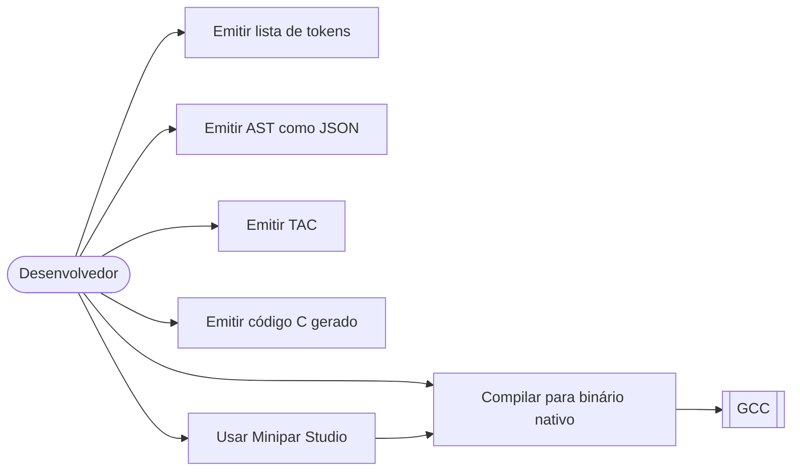
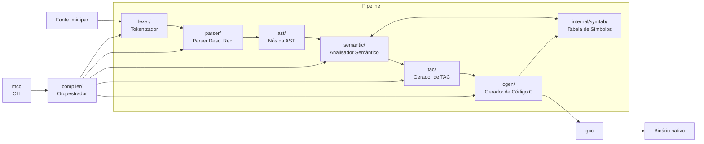
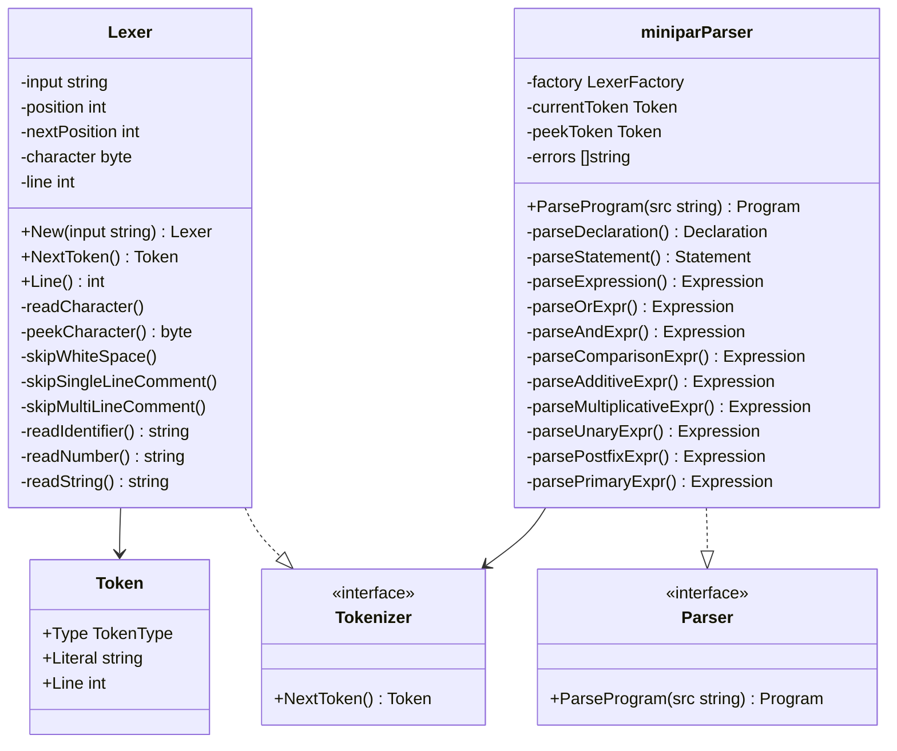
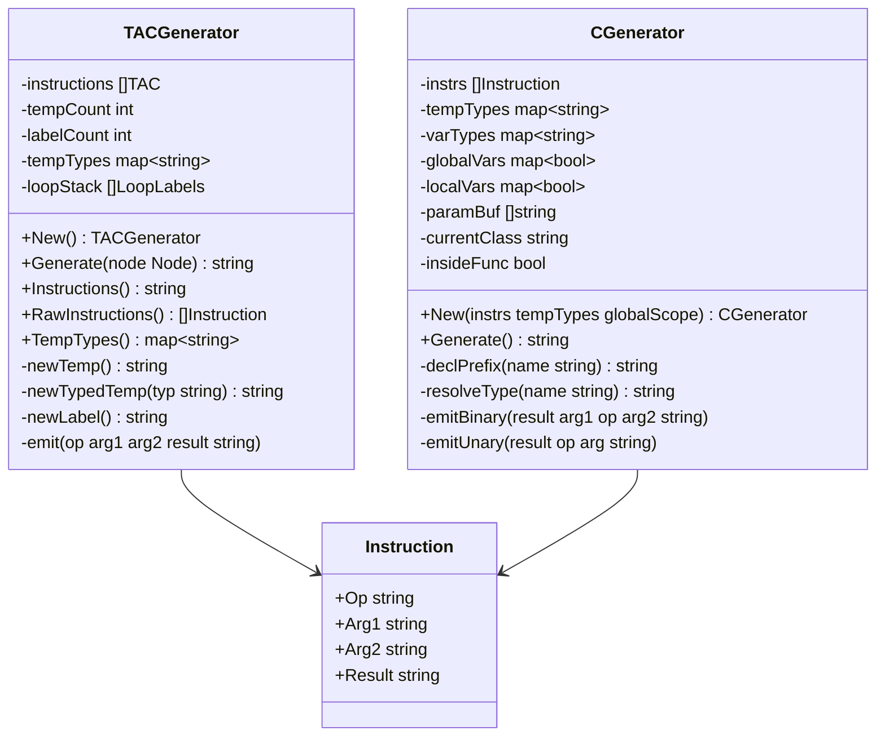

### Diagrama de Casos de Uso

### Arquitetura de Componentes

### Diagramas de Classe por Componente

#### Lexer e Parser

#### Analisador Semântico e Tabela de Símbolos

#### Gerador TAC e Gerador C

